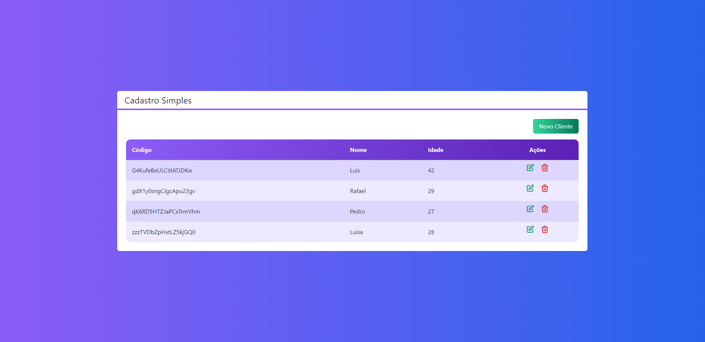
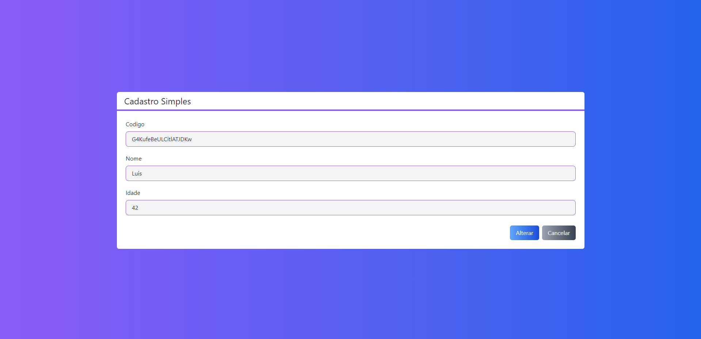

<h1 align="center">Projeto cadastro simples</h1>
<h1 align="center">

</h1>

 <a href="#-sobre-o-projeto">Sobre</a> •
 <a href="#-tecnologias">Tecnologias</a> •
 <a href="#-instalação">Instalação</a> •
 <a href="#-layout">Layout</a> •  
 <a href="#-como-contribuir-para-o-projeto">Contribuir</a> •
 <a href="#-licença">Licença</a> •    

## 💻 Sobre o projeto
O presente projeto representa uma seção do curso web moderno da escola Cod3r cursos on-line ministrado pelo professor Leonardo Moura Leitao.
A proposta é o desenvolvimento de uma aplicação de cadastro simples realizando os aspectos básicos do CRUD consumindo e gravando as informações diretamente no firebase.

## 🛠 Tecnologias

As seguintes ferramentas foram usadas na construção do projeto:

- [Node.js](https://nodejs.org/en/)
- [ReactJs](https://reactjs.org/)
- [NextJs](https://nextjs.org/)
- [Firebase](https://firebase.google.com/?hl=pt)
- [Firestore](https://firebase.google.com/docs/firestore)
- [Tailwindscss](https://tailwindcss.com/)
- [Heroicons](https://heroicons.com/)

## 📋 Instalação

1. Clonar o repositório:

~~~
git clone https://github.com/rfaelfp/Projeto-cadastro-simples.git
~~~
2. Acessar o diretório do projeto pelo terminal:

~~~
./next-crud
~~~
3.Instalar as dependencias executando:
~~~
npm i
~~~
4. Inicializar o projeto no firebase com o nome "next-crud" em modo de teste, criar o arquivo ".env.local" no projeto raiz e preencher as variáveis abaixo com as informações disponibilizadas na configuração do firebase:
~~~
NEXT_PUBLIC_FIREBASE_API_KEY=<configurações do SDK>
NEXT_PUBLIC_FIREBASE_AUTH_DOMAIN=<configurações do SDK>
NEXT_PUBLIC_FIREBASE_PROJECT_ID=<configurações do SDK>
~~~
5. Rodar o projeto como dev
~~~
npm run dev
~~~
6. Acessar url abaixo no browser
~~~
http://localhost:3000/
~~~

## 🎨 Layout

### Visão Geral

   
&nbsp;&nbsp;
  
&nbsp;&nbsp;

## 💪 Como contribuir para o projeto

1. Faça um **fork** do projeto.
2. Crie uma nova branch com as suas alterações: `git checkout -b my-feature`
3. Salve as alterações e crie uma mensagem de commit contando o que você fez: `git commit -m "feature: My new feature"`
4. Envie as suas alterações: `git push origin my-feature`
> Caso tenha alguma dúvida confira este [guia de como contribuir no GitHub](./CONTRIBUTING.md)

<h2 id=autor>:grin: Autor</h2>

Desenvolvido por 
<a href="https://www.linkedin.com/in/rafael-ferreira-pedrosa-021b16ba/" target="_blank">Rafael Ferreira Pedrosa</a>.

## 📝 Licença

Este projeto esta sobe a licença [MIT](./LICENSE).
